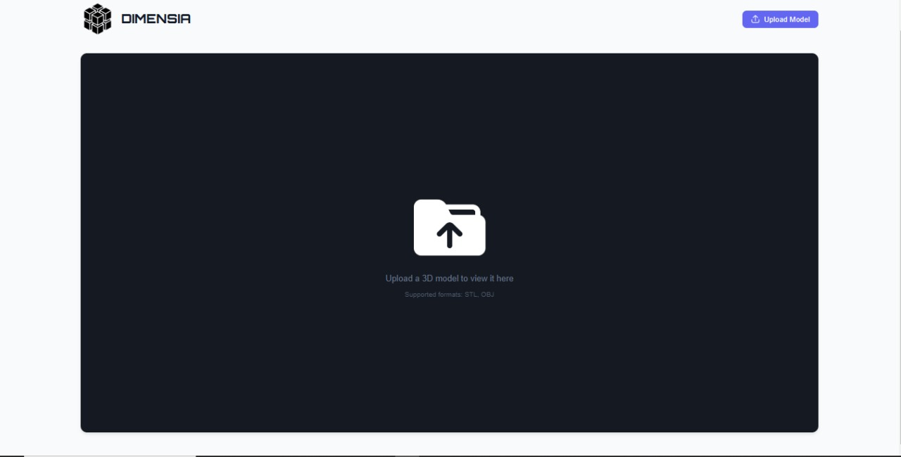

# Dimensia - 3D Model Viewer & Converter (Frontend)

A React-based web application for viewing and converting 3D models from STL to OBJ format.

## Features

- Interactive 3D model viewer
- STL to OBJ file conversion
- Responsive user interface
- Integration with backend conversion services

## Prerequisites

Before you begin, ensure you have the following installed:
- Node.js (v14.0.0 or later)
- npm (v6.0.0 or later)
- Git

## Installation

1. Clone the repository:
   ```bash
   git clone https://github.com/PL-SaiPrakash/frontend-Dimensia.git
   cd frontend-Dimensia
   ```

2. Install dependencies:
   ```bash
   npm install
   ```

3. Create a `.env` file in the root directory and add:
   ```
   REACT_APP_API_URL=http://localhost:5000
   ```
   Note: Adjust the URL if your backend runs on a different port or host.

## Running the Application

1. Start the development server:
   ```bash
   npm start
   ```

2. Open your browser and navigate to:
   ```
   http://localhost:3000
   ```

## Building for Production

To create a production build:

```bash
npm run build
```

The build artifacts will be stored in the `build/` directory.

## Usage

1. Upload an STL file using the file uploader
2. View the 3D model in the interactive viewer
3. Adjust viewing angles using mouse controls:
   - Left-click and drag to rotate
   - Right-click and drag to pan
   - Scroll to zoom
4. Click the "Convert to OBJ" button to process the file
5. Download the converted OBJ file

## Technologies Used

- React.js
- Three.js for 3D rendering
- React Three Fiber

## Screenshots

### Home Page

*The main interface where users can upload 3D models*

### Model Viewer

*Interactive 3D viewer with rotation, pan and zoom controls*

## Related Projects

- [Dimensia Backend](https://github.com/PL-SaiPrakash/backend-Dimensia) - Flask backend for this application
